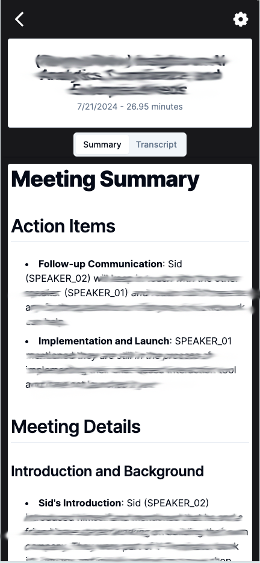

<h1 align="center">
    <Image src="https://notes.lytix.co/_next/image?url=%2Flytix-notes-logo.png&w=256&q=75" alt="Notehound" width="100" height="100">
</h1>
<h2 align="center">
    NoteHound
</h2>
<p align="">
    Notehound is a note taking app that summarizes you meetings for you. Notes and transcripts are stored in RDS along with Pinecone to allow you to search across your notes.
</p>
<p align="center">
    <a href="https://lytix.co">
        
    </a>  
    <a href="https://discord.gg/8TCbHsSe">
        
    </a>
</p>

<p align="center">
        
</p>

## Live demo

[**Check it out here 🚀**](https://notehound.lytix.co)

## Screenshots

View a summary of your recent meetings (image 1). Automatically generate notes and actions items or see the transcription (image 2). Search across your notes using natural language via Pinecone (image 3).

<p align="center">
    
    
    
</p>

## Quickstart

#### Prerequisites

- [Pinecone](https://www.pinecone.io/) account
  - Pinecone API key (see [here](https://docs.pinecone.io/guides/get-started/authentication#find-your-pinecone-api-key))
- Access to an RDS database, in our case we used [AWS RDS](https://aws.amazon.com/rds/)
- [Firebase](https://firebase.google.com/docs/auth) account
  - Firebase Config Object for Backend (see [here](https://firebase.google.com/docs/web/learn-more#config-object))
  - Firebase Config for Frontend (see [here](https://stackoverflow.com/questions/52500573/where-can-i-find-my-firebase-apikey-and-authdomain))
- [Hugging Face](https://huggingface.co/) account and API key
  - You'll also need to read & agree to the terms for [this model](https://huggingface.co/pyannote/speaker-diarization-3.1)

### Backend

Navigate to the backend folder

```
cd Backend
```

Install our dependencies

```
pip install -r req.txt
```

Defined our env vars

- `PINECONE_API_KEY`: [Pinecone API Key](https://www.pinecone.io/docs/api-keys/)
- `FIREBASE_PROJECT_ID`: [Firebase Project ID](https://console.firebase.google.com/project/lytix-806ad/settings/general)
- `DATABASE_URL`: [RDS Database URL](https://console.aws.amazon.com/rds/home?region=us-east-1#dbinstances:id=lytixnote;is-cluster=false). E.g. `postgresql://{{ username }}:{{password }}@{{host }}:{{port }}/{{database }}`
- `HF_TOKEN`: [Hugging Face Token](https://huggingface.co/settings/tokens)
- `FIREBASE_CONFIG`: Parsed up firebase config (e.g. `JSON.parse(...firebaseConfig)`). Please see [here](https://firebase.google.com/docs/web/learn-more#config-object) for instructions
  - The shape of your firebase config looks like this
  ```
  {
      "type":"service_account",
      "project_id":"{{ project_id }}",
      "private_key_id":"{{ private_key }}",
      "private_key":"{{ private_key }}",
      "client_email":"{{ client_email }}",
      "client_id":"{{ client_id }}",
      "auth_uri":"https://accounts.google.com/o/oauth2/auth",
      "token_uri":"https://oauth2.googleapis.com/token",
      "auth_provider_x509_cert_url":"https://www.googleapis.com/oauth2/v1/certs",
      "client_x509_cert_url":"https://www.googleapis.com/robot/v1/metadata/x509/{{ client_email }}",
      "universe_domain":"googleapis.com"
    }
  ```

### Frontend

Navigate to the frontend folder

```
cd Frontend
```

Install our dependence's

```
npm install
```

Defined our env vars

- `NEXT_PUBLIC_BASE_URL`: http://localhost:4040
- `NEXT_PUBLIC_FIREBASE_CONFIG`: Parsed up firebase config (e.g. `JSON.parse(...firebaseConfig)`)
  - The shape of your firebase config looks like this
  ```
  {
    "apiKey":"123-345",
    "authDomain":"{{project }}.firebaseapp.com",
    "projectId":"{{project }}",
    "storageBucket":"{{project }}.appspot.com",
    "messagingSenderId":"{{messagingSenderId}}",
    "appId":"{{appId}}"
  }
  ```

Start the NextJS app

```
npm run dev
```

**You now can login and start using the app! Upload your audio and watch it process in the background 🚀**

## Architecture

All requests are routed first thoughtt [server.py](https://github.com/lytix-labs/notehound/blob/master/Backend/server.py).

The processing jobs happen on the server itself (to keep things simple), so there is no external celery worker or message queue.

To accomplish this, we run a [FastAPI background task](https://fastapi.tiangolo.com/tutorial/background-tasks/). We can't run the job directly on the FastAPI server itself (since otherwise it will hog all the resources and requests will not get served).

To get around this, the fast api server manages a list of pending audio jobs. For each job we start a new subprocess via our [BackgroundTaskQueue.py](https://github.com/lytix-labs/notehound/blob/master/Backend/src/BackgroundTaskQueue.py) class.

This is what manages and runs the actual analysis of the meeting. Check out that code [here](https://github.com/lytix-labs/notehound/blob/master/Backend/src/processAudio.py).
